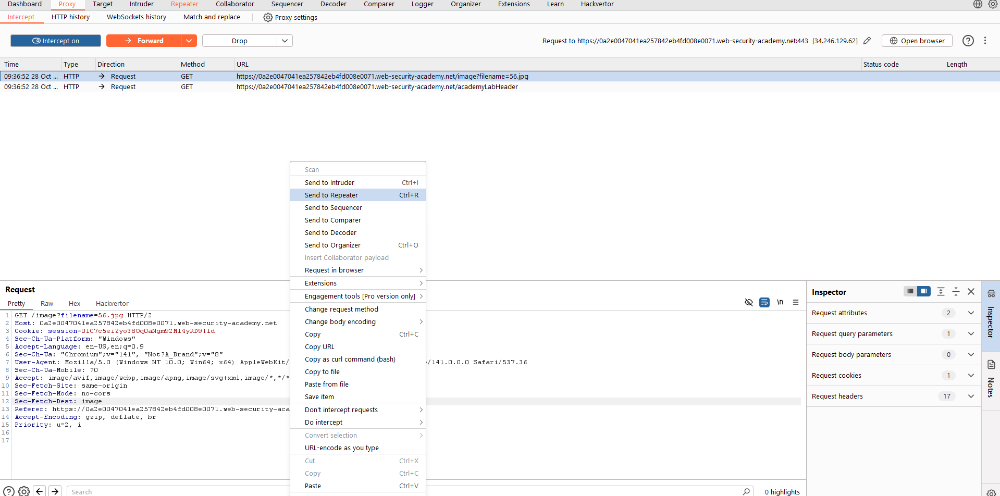
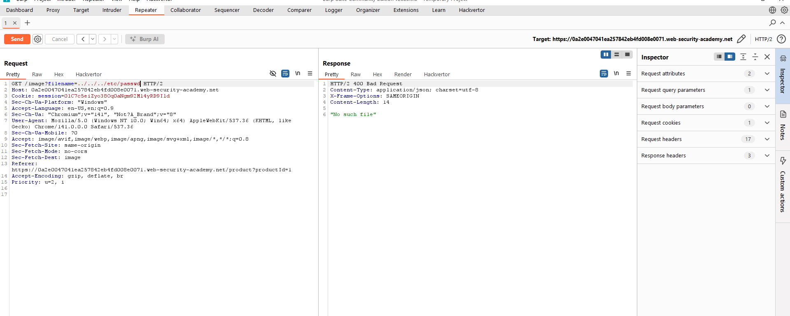
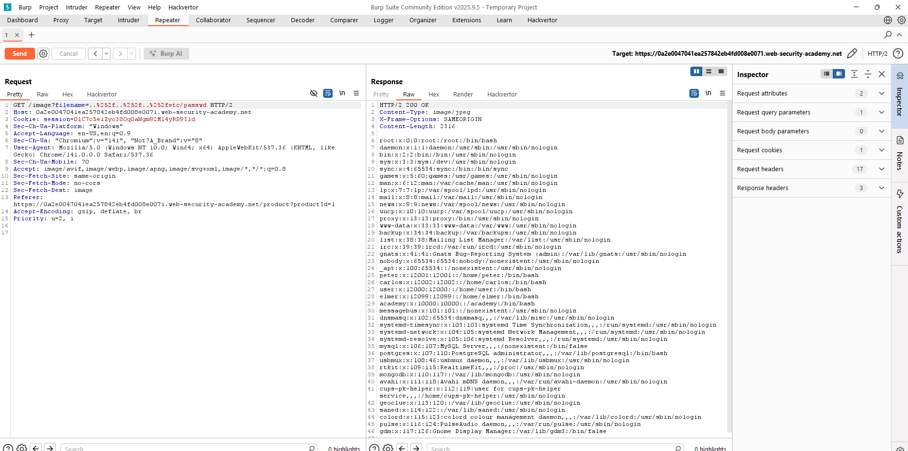
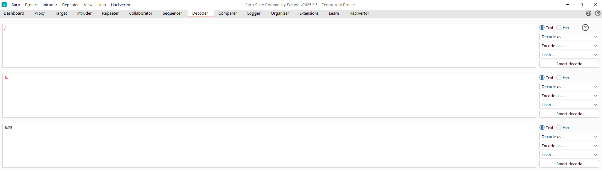
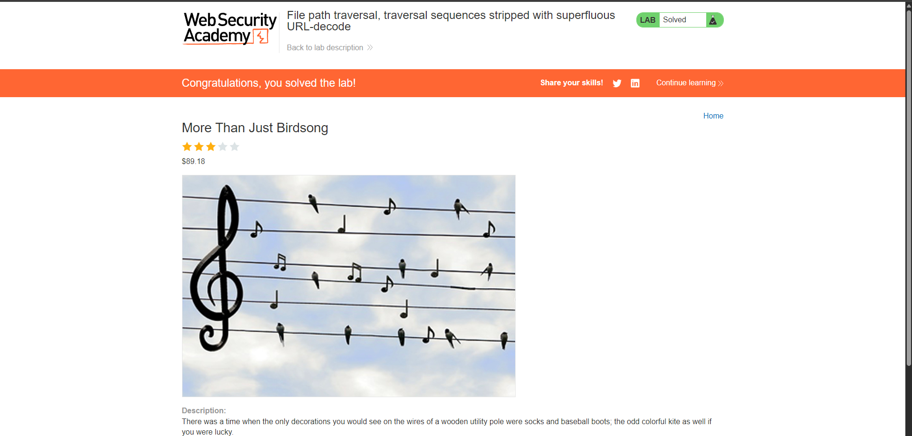

# LAB 4: File path traversal, traversal sequences stripped with superfluous URL-decode
<div align="center">


</div>


## Mô tả
Lab này khai thác lỗ hổng path traversal khi ứng dụng thực hiện kiểm tra và loại bỏ các chuỗi path traversal, sau đó lại thực hiện URL-decode trước khi sử dụng input. Điều này cho phép kẻ tấn công vượt qua kiểm tra bằng cách sử dụng các chuỗi đã được mã hóa URL hoặc mã hóa kép.

## Các bước thực hiện
1. Sử dụng Burp Suite để intercept request lấy ảnh sản phẩm.


2. Thay đổi giá trị tham số `filename` thành:
	```
	../../../etc/passwd
	```



2. Thay đổi giá trị tham số `filename` thành:
	```
	..%252f..%252f..%252fetc/passwd
	```


sinh ra được payload dấu `/` được mã hóa 2 lần

3. Gửi request và quan sát response trả về nội dung file `/etc/passwd`.





