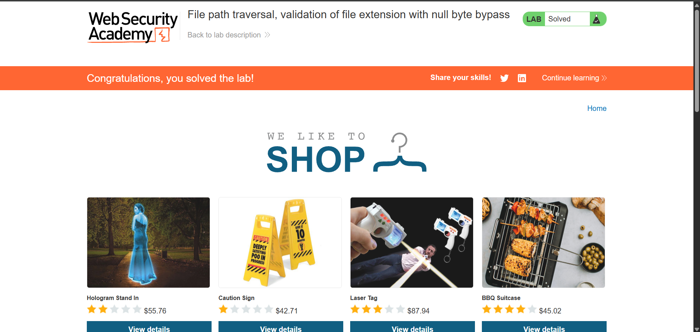

# Báo cáo (tóm tắt) — Phát hiện rò rỉ file hệ thống qua tham số `filename`

> **Lưu ý pháp lý:** chỉ thực hiện kiểm thử trên hệ thống **bạn sở hữu** hoặc hệ thống mà bạn đã được **ủy quyền bằng văn bản**. Tôi không cung cấp các bước khai thác chi tiết.

## 1. Tóm tắt ngắn gọn
- Mục tiêu: yêu cầu lấy hình ảnh sản phẩm.
- Tham số quan sát: `filename`.
- Khi `filename` được gán một giá trị dạng tương tự `../../../etc/passwd%00.png`, phản hồi từ server **chứa nội dung của `/etc/passwd`** (tức là đã xảy ra rò rỉ file hệ thống).
- Hệ quả: rò rỉ thông tin hệ thống, khả năng leo thang ảnh hưởng phụ thuộc vào nội dung file khác có thể đọc được.

## 2. Ý nghĩa bảo mật
- Đây là dấu hiệu của **Local File Inclusion (LFI)** hoặc **path traversal** kèm vấn đề xử lý ký tự null (`%00`), và/hoặc xử lý không đúng đường dẫn khi trả file tĩnh.
- Mức rủi ro: **Cao** — lộ thông tin nhạy cảm, có thể dùng để thu thập thông tin phục vụ tấn công tiếp theo.

## 3. Gợi ý phát hiện & giám sát (không chỉ dẫn khai thác)
- Kiểm tra logs web server (access + error) để tìm các request có mẫu `../` hoặc `%00`.
- Thiết lập cảnh báo cho các phản hồi trả về nội dung văn bản (text/plain, text/x) khi endpoint dự kiến trả `image/*`.
- Xác minh tỉ lệ 200 responses với content-type không khớp (ví dụ: `Content-Type: text/plain` trên endpoint ảnh).

## 4. Các bước khắc phục (thẳng, rõ ràng)
1. **Allow-list đường dẫn**: map một tập hợp tên file / id hợp lệ → đường dẫn trên filesystem; không dùng giá trị do user nhập để ghép trực tiếp thành đường dẫn.
2. **Canonicalize và kiểm tra**: khi không thể dùng allow-list, canonicalize đường dẫn (realpath) và đảm bảo file nằm trong thư mục được phép (ví dụ `/var/www/images/products/`). Từ chối mọi đường dẫn thoát ra ngoài thư mục gốc.
3. **Loại bỏ / từ chối ký tự null** (`\0`): làm sạch input, loại bỏ byte NULL trước khi xử lý tên file.
4. **Tách trách nhiệm**: phục vụ file tĩnh qua webserver (nginx/Apache) với cấu hình an toàn; nếu phải dùng ứng dụng để đọc file, đảm bảo chạy dưới user ít quyền nhất.
5. **Kiểm tra kiểu MIME**: trả header `Content-Type` chính xác cho file ảnh và từ chối các file có MIME không phù hợp.
6. **Giới hạn quyền truy cập**: những file nội bộ (ví dụ `/etc/*`) phải hoàn toàn không có trong phạm vi phục vụ; cấu hình filesystem và permission cho thư mục chứa ảnh.
7. **Audit & forensic**: lưu giữ log chi tiết (request, IP, user-agent, tham số) cho các request bất thường để điều tra sau này.

## 5. Ghi chú ngắn
- Thực hiện **patch** và **kiểm thử** (với scope rõ ràng) để đảm bảo endpoint chỉ phục vụ file hợp lệ.
- Nếu cần, audit toàn bộ endpoint phục vụ tài nguyên tĩnh để tránh tương tự lỗi path traversal/LFI.
